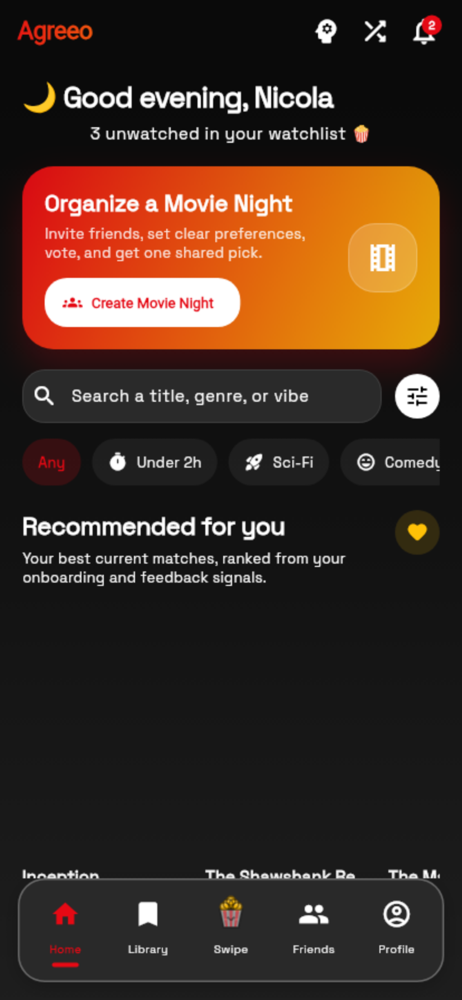
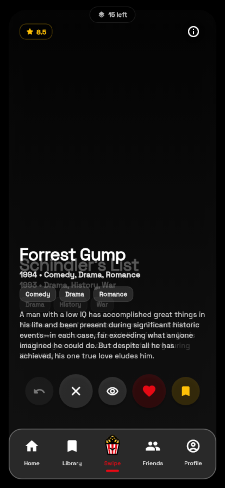
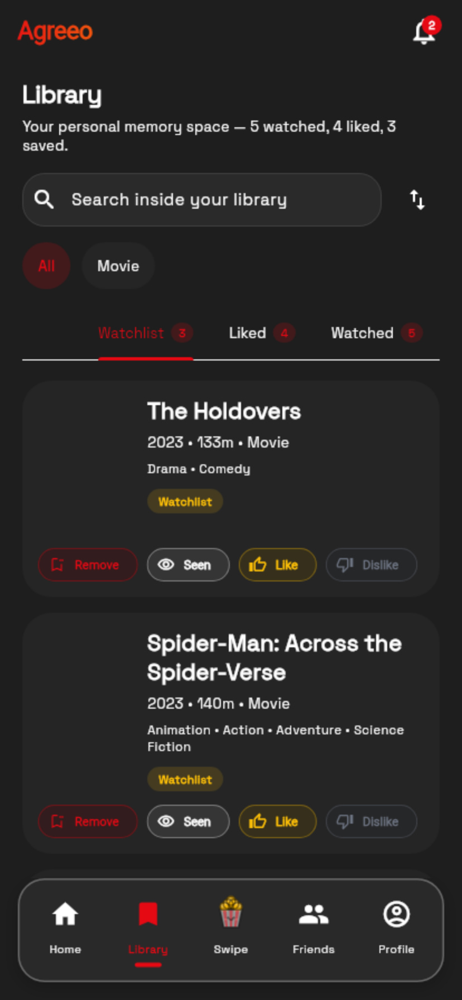

<div align="center">
  
  <h1>Agreeo</h1>
  <p><strong>Graph-Native Movie Recommendation &amp; Social Decision Engine</strong></p>

  <p>
    <a href="https://flutter.dev"></a>
    <a href="https://neo4j.com"></a>
    <a href="https://nodejs.org"></a>
    <a href="https://www.docker.com"></a>
    <a href="https://www.uniroma1.it"></a>
  </p>

  <p>
    <em>Academic Capstone Project for Data Management / Database Systems (A.Y. 2025/2026)</em><br />
    <strong>Sapienza Università di Roma</strong><br />
    <strong>Authors:</strong> Antonio Rubino &bull; Nicola Moscufo
  </p>
</div>

---

## 📋 Table of Contents

- [Overview & System Vision](#-overview--system-vision)
- [Why a Graph Database?](#-why-a-graph-database)
- [Key Features](#-key-features)
- [Property Graph Architecture & Schema](#-property-graph-architecture--schema)
- [Core Cypher Queries Showcase](#-core-cypher-queries-showcase)
  - [1. Collaborative Filtering Traversal (`M23`)](#1-collaborative-filtering-traversal-m23)
  - [2. Hybrid Retrieval with Vector Index & RRF (`M24`)](#2-hybrid-retrieval-with-vector-index--rrf-m24)
  - [3. Transactional Quota Increment (`M06`)](#3-transactional-quota-increment-m06)
  - [4. Symmetric Social Invariants (`S06`)](#4-symmetric-social-invariants-s06)
  - [5. Group Voting Lock on Event Node (`S44`)](#5-group-voting-lock-on-event-node-s44)
- [Mobile Client Previews](#-mobile-client-previews)
- [Technical Architecture & Stack](#-technical-architecture--stack)
- [Getting Started & Local Setup](#-getting-started--local-setup)
  - [Prerequisites](#prerequisites)
  - [1. Environment Setup](#1-environment-setup)
  - [2. Start Infrastructure (Docker Compose)](#2-start-infrastructure-docker-compose)
  - [3. Ingest MovieLens & Vector Embeddings](#3-ingest-movielens--vector-embeddings)
  - [4. Run Backend Server](#4-run-backend-server)
  - [5. Run Flutter Mobile App](#5-run-flutter-mobile-app)
- [Verification & Automated Tests](#-verification--automated-tests)
- [Technical Documentation Index](#-technical-documentation-index)
- [License & Dataset Attribution](#-license--dataset-attribution)

---

## 🎯 Overview & System Vision

**Agreeo** is a production-grade, graph-native mobile application designed to solve the two biggest frictions in digital cinema discovery:
1. **Personalized Taste Discovery**: Moving beyond static genre filters by surfacing nuanced movie affinities derived from multi-hop peer behavioral ratings and semantic tag vector spaces.
2. **Synchronous Group Decision-Making (*Movie Night*)**: Eliminating endless group chat debates through real-time, concurrent voting sessions that dynamically calculate collective group compatibility matrices.

Rather than relying on isolated relational tables and costly runtime multi-join chains, Agreeo is built from the ground up around **Neo4j 5**, leveraging **Index-Free Adjacency** to treat relationships (friendships, likes, watchlist, ratings, tag embeddings) as first-class data.

---

## 💡 Why a Graph Database?

In collaborative filtering and social group discovery, querying traversals across multiple hops is central to every operation:

```
(User) ──[:LIKED]──> (Movie) <──[:MATCHES_TMDB]── (MovieLensMovie) <──[:RATED]── (SimilarUser) ──[:RATED]──> (CandidateMovie)
```

- **Relational DBMS Bottleneck**: In a traditional SQL model, answering a 4-hop collaborative recommendation requires repeated recursive self-joins across large review and interaction tables ($O(N^k)$ complexity). As the transaction volume grows, index scans degrade query latencies exponentially.
- **Index-Free Adjacency Advantage**: In Neo4j's property graph model, each node holds direct physical pointers to adjacent edges and neighbor nodes. Traversal cost is strictly $O(\text{degree})$ — proportional to the visited subgraph, and completely independent of the total database size.
- **Unified Graph + Vector Storage**: Neo4j 5 natively indexes 384-dimensional dense vectors alongside topological graph nodes, allowing graph traversals and approximate cosine vector similarity to be fused in a single declarative Cypher execution pipeline.

---

## ✨ Key Features

| Feature | Description | Cypher Foundation |
| :--- | :--- | :--- |
| **Personal Daily Deck** | Curated daily suggestions deck with swipe mechanics and server-enforced daily limits. | `M05`, `M06`, `M23` |
| **Hybrid Recommendation** | Fuses 4-hop collaborative graph walks with 384-D cosine vector similarity via Reciprocal Rank Fusion (RRF). | `M23`, `M24` |
| **Movie Night Sessions** | Real-time group matchmaking session with synchronized voting rounds and instant winner resolution. | `S40`–`S44` |
| **Symmetric Social Graph** | Frictionless friendships stored as single undirected memory edges with block-invalidation checks. | `S01`–`S07` |
| **Idempotent Ingestion** | Deterministic bridge connecting external metadata catalogs without destructive overwrites. | `I08`, `I09`, `M01` |
| **Transactional Consistency** | Multi-entity state transitions bundled in ACID write boundaries (`session.executeWrite`). | `M06`, `S06`, `S44` |

---

## 📐 Property Graph Architecture & Schema

Agreeo enforces a strict **Dual-Catalog Architecture** to maintain clean boundaries between external analytical signals and canonical application entities:

```
  ┌──────────────────────────────────────────────┐       ┌──────────────────────────────────────────────┐
  │              APPLICATION GRAPH               │       │               MOVIELENS GRAPH                │
  │           (Canonical TMDB Entities)          │       │             (Analytical Dataset)             │
  │                                              │       │                                              │
  │   (:AppUser {uid, email, displayName})       │       │    (:MovieLensUser {userId})                 │
  │         │                 │                  │       │          │                                   │
  │   [:FRIEND]         [:LIKED / :WATCHLISTED]  │       │       [:RATED {rating, timestamp}]           │
  │         │                 │                  │       │          │                                   │
  │         ▼                 ▼                  │       │          ▼                                   │
  │   (:AppUser)        (:Movie {tmdbId, title}) │       │    (:MovieLensMovie {movieId})               │
  │                           │                  │       │          │                                   │
  │                      [:IN_GENRE]             │       │      [:HAS_TAG]                              │
  │                           ▼                  │       │          ▼                                   │
  │                       (:Genre)               │       │       (:Tag {name, embedding: vector<384>}) │
  └───────────────────────────▲──────────────────┘       └──────────┬───────────────────────────────────┘
                              │                                     │
                              └───────── [:MATCHES_TMDB] ───────────┘
                                  (Deterministic Structural Bridge)
```

### Key Schema Entities:
- **`(:AppUser)`**: Authenticated users, profiles, and quota trackers (`uid` uniqueness constraint).
- **`(:Movie)`**: Canonical product catalog enriched via TMDB API (`tmdbId` uniqueness constraint).
- **`(:MovieLensMovie)` & `(:MovieLensUser)`**: Read-only analytical dataset (*MovieLens ml-latest-small*: 610 users, 9,742 movies, 100,836 ratings, 3,683 tag assignments).
- **`[:MATCHES_TMDB]`**: Structural ID bridge derived from `links.csv`, avoiding fragile heuristic title matching.
- **`(:MovieNight)`**: Real-time collaborative group decision sessions with concurrent voter state.

---

## ⚡ Core Cypher Queries Showcase

### 1. Collaborative Filtering Traversal (`M23`)
Executes a 4-hop graph traversal combining positive user taste seeds with MovieLens peer ratings, applying **exponential recency decay**, **centered rating weights**, **popularity damping**, and **support shrinkage**:

```cypher
MATCH (me:AppUser {uid: $uid})-[sig:LIKED|SELECTED_FAVORITE]->(seed:Movie)
MATCH (seed)<-[:MATCHES_TMDB]-(sMl:MovieLensMovie)<-[r1:RATED]-(sim:MovieLensUser)
WHERE r1.rating >= 4.0
WITH me, sim,
     sum(sig.weight * exp(-0.005 * duration.inDays(sig.createdAt, datetime()).days)
         * (r1.rating - 3.0)
         * (1.0 / sqrt(log(coalesce(seed.movieLensRatingCount, 1) + 10.0)))) AS simScore
WHERE simScore > 0
MATCH (sim)-[r2:RATED]->(recMl:MovieLensMovie)-[:MATCHES_TMDB]->(rec:Movie)
WHERE NOT (me)-[:LIKED|DISLIKED|WATCHLISTED|ALREADY_SEEN]->(rec)
WITH rec, count(DISTINCT sim) AS support, sum(simScore * (r2.rating - 3.0)) AS rawScore
RETURN rec.tmdbId AS tmdbId, rec.title AS title,
       (rawScore * (support / (support + 5.0))) AS collaScore
ORDER BY collaScore DESC LIMIT 20;
```

### 2. Hybrid Retrieval with Vector Index & RRF (`M24`)
Combines candidate scores from the collaborative graph traversal with semantic vector similarity calculated across 384-dimensional tag embeddings using **Reciprocal Rank Fusion (RRF)**:

```cypher
CALL db.index.vector.queryNodes('tag_embeddings', 50, $userTasteVector)
YIELD node AS tag, score AS vectorSim
MATCH (rec:Movie)-[:HAS_TAG]->(tag)
WHERE NOT (me:AppUser {uid: $uid})-[:LIKED|DISLIKED|WATCHLISTED|ALREADY_SEEN]->(rec)
WITH rec, max(vectorSim) AS semanticScore
ORDER BY semanticScore DESC
WITH collect(rec)[..30] AS vectorCandidates, ...
// Reciprocal Rank Fusion: RRF(m) = sum(w_s / (60 + rank_s(m)))
```

### 3. Transactional Quota Increment (`M06`)
Enforces daily interaction quotas atomically inside a single `executeWrite` boundary, rolling back both the quota increment and the interaction edge on any downstream failure:

```cypher
MATCH (u:AppUser {uid: $uid})
MERGE (q:DailySwipeQuota {key: $quotaKey})
  ON CREATE SET q.used = 0, q.day = date($day)
MERGE (u)-[:HAS_DAILY_QUOTA]->(q)
SET q.used = coalesce(q.used, 0) + $increment
RETURN q.used AS usedToday;
```

### 4. Symmetric Social Invariants (`S06`)
Accepts pending friend requests and creates an **undirected relationship** (`-[:FRIEND]-`) stored as a single physical memory edge, guarded by declarative pattern negation against blocks:

```cypher
MATCH (from:AppUser {uid: $uid}), (to:AppUser {uid: $targetUserId})
WHERE from.uid <> to.uid
  AND NOT (from)-[:FRIEND]-(to)
  AND NOT (from)-[:BLOCKED]->(to)
  AND NOT (to)-[:BLOCKED]->(from)
MATCH (to)-[r:SENT_FRIEND_REQUEST {status: "pending"}]->(from)
SET r.status = "accepted", r.updatedAt = datetime()
MERGE (from)-[a:FRIEND]-(to)
  ON CREATE SET a.createdAt = datetime()
RETURN r.requestId;
```

### 5. Group Voting Lock on Event Node (`S44`)
Serializes concurrent votes during real-time *Movie Night* sessions by acquiring an **exclusive write lock** on the root `MovieNight` node, eliminating race conditions in tie-break rounds:

```cypher
MATCH (u:AppUser {uid: $uid})-[p:PARTICIPATES_IN]->(ev:MovieNight {id: $id})
MATCH (ev)-[cand:HAS_CANDIDATE]->(m:Movie {tmdbId: $tmdbId})
WHERE p.status = "joined" AND NOT coalesce(cand.eliminated, false)
MERGE (u)-[v:VOTED_IN {eventId: $id}]->(m)
SET v.vote = $vote, v.updatedAt = datetime(),
    ev.status = "voting",
    ev.updatedAt = datetime()  // Exclusive write-lock serializes concurrent votes
RETURN m.tmdbId;
```

---

## 📱 Mobile Client Previews

<div align="center">
  <table border="0">
    <tr>
      <td align="center"><strong>Login &amp; Auth</strong></td>
      <td align="center"><strong>Personalized Home</strong></td>
      <td align="center"><strong>Discovery Swipe Deck</strong></td>
      <td align="center"><strong>Social &amp; Friends</strong></td>
      <td align="center"><strong>User Library</strong></td>
    </tr>
    <tr>
      <td></td>
      <td></td>
      <td></td>
      <td></td>
      <td></td>
    </tr>
  </table>
</div>

---

## 🏗️ Technical Architecture & Stack

Agreeo adopts a decoupled, multi-tier micro-architecture:

```
┌─────────────────────────────────────────────────────────────────────────────┐
│                          FLUTTER CLIENT (MOBILE/WEB)                        │
│   Riverpod 2.x State Management • Feature-First Directory Layout • Material 3 │
└──────────────────────────────────────┬──────────────────────────────────────┘
                                       │ HTTP REST / WebSocket (Socket.IO)
                                       ▼
┌─────────────────────────────────────────────────────────────────────────────┐
│                         NODE.JS / EXPRESS API BACKEND                       │
│   JWT Stateless Authentication • Driver Connection Pooling • Request Guards │
└──────────────────────┬───────────────────────────────┬──────────────────────┘
                       │ Cypher (Bolt / 7687)          │ HTTPS
                       ▼                               ▼
┌──────────────────────────────────────────────┐ ┌────────────────────────────┐
│              NEO4J 5 GRAPH DATABASE          │ │         TMDB API           │
│   Index-Free Adjacency • 384-D Vector Index  │ │  (Canonical Movie Metadata,│
│   ACID Transactions • Cypher 5.26 Engine     │ │   Posters, Trailers)       │
└──────────────────────────────────────────────┘ └────────────────────────────┘
```

- **Frontend**: Flutter 3.x, Dart, Riverpod (`StateNotifierProvider`), Dio, Socket.IO Client.
- **Backend API**: Node.js 18+, Express, Socket.IO, `neo4j-driver` 5.x, `dotenv`, `bcryptjs`, `jsonwebtoken`.
- **Database**: Neo4j 5.26 Community & Enterprise, Neo4j Vector Search (Cosine Similarity).
- **Deployment & Orchestration**: Multi-container Docker Compose, Healthcheck probes (`/health`, `/health/db`).

---

## 🚀 Getting Started & Local Setup

### Prerequisites
- **Git**
- **Docker** & **Docker Compose v2+**
- **Flutter SDK 3.x** (optional, for client builds)
- **Node.js 18+** & **npm** (optional, for native backend dev)

### 1. Environment Setup
Clone the repository and instantiate the required `.env` configuration files:

```bash
git clone https://github.com/nicolamoscufo/agreeo.git
cd agreeo

# Create backend and root compose environment files
cp .env.example .env
cp backend/.env.example backend/.env
```

Configure the mandatory secrets in `.env`:
* `JWT_SECRET`: Random 32+ character string (`openssl rand -base64 48`).
* `NEO4J_PASSWORD`: Secure password for the `neo4j` user.
* `TMDB_ACCESS_TOKEN`: Bearer token from [TheMovieDatabase API](https://developer.themoviedb.org/docs/getting-started).

### 2. Start Infrastructure (Docker Compose)
Launch Neo4j, backend services, and automated data initializers in detached mode:

```bash
docker compose up -d neo4j
```
*Access the interactive Neo4j Browser UI at [http://localhost:7474](http://localhost:7474).*

### 3. Ingest MovieLens & Vector Embeddings
Run the automated ingestion pipeline to seed constraints, schemas, links, ratings, and tag vector embeddings:

```bash
# Ingest MovieLens dataset (ml-latest-small)
docker compose up neo4j-init

# Generate 384-D tag embeddings and build vector indexes
docker compose up --build semantic-init
```

### 4. Run Backend Server
```bash
# Start backend service with docker compose
docker compose up -d backend

# Check backend health
curl http://localhost:3000/health
curl http://localhost:3000/health/db
```

### 5. Run Flutter Mobile App
```bash
# Fetch Flutter dependencies
flutter pub get

# Run on connected device, emulator, or Chrome
flutter run
```

---

## 🧪 Verification & Automated Tests

Agreeo maintains a comprehensive automated testing suite covering both frontend widgets/state and backend database transaction boundaries:

```bash
# Run Flutter unit and widget test suite (39 tests)
flutter test

# Run Flutter static analysis (0 warnings/errors)
flutter analyze

# Run Backend Jest test suite (59 tests across auth, social, recommendations)
cd backend
npm test
```

---

## 📚 Technical Documentation Index

Deep-dive technical documentation and blueprints are available in the [`docs/`](docs/) directory:

- 📖 **[`docs/NEO4J_QUERY_TECHNICAL_REFERENCE.md`](docs/NEO4J_QUERY_TECHNICAL_REFERENCE.md)**: Full Cypher catalog (M01–M24, S01–S44, I01–I09, P01–P05) with query parameters, execution explanations, and ACID analysis.
- 📐 **[`docs/NEO4J_TMDB_MOVIELENS_ARCHITECTURE.md`](docs/NEO4J_TMDB_MOVIELENS_ARCHITECTURE.md)**: Detailed dual-catalog architecture and deterministic bridge mechanics.
- 🔌 **[`docs/BACKEND_CONTRACT.md`](docs/BACKEND_CONTRACT.md)**: Complete HTTP REST & Socket.IO API specifications, schemas, and status codes.
- 🧭 **[`docs/ROUTING_MAP.md`](docs/ROUTING_MAP.md)**: Flutter routing tree, state flows, and navigation architecture.
- 🎓 **[`docs/RECOMMENDATION_ENGINE_EXAM_GUIDE.md`](docs/RECOMMENDATION_ENGINE_EXAM_GUIDE.md)**: Academic oral defense study guide, mathematical derivations, and live demo presets.

---

## 📄 License & Dataset Attribution

- **Source Code**: Released under the [MIT License](LICENSE).
- **MovieLens Dataset**: Provided by [GroupLens Research](https://grouplens.org/datasets/movielens/) for non-commercial research and educational use.
- **TMDB API**: Movie metadata and artwork provided courtesy of [The Movie Database (TMDB)](https://www.themoviedb.org/).
