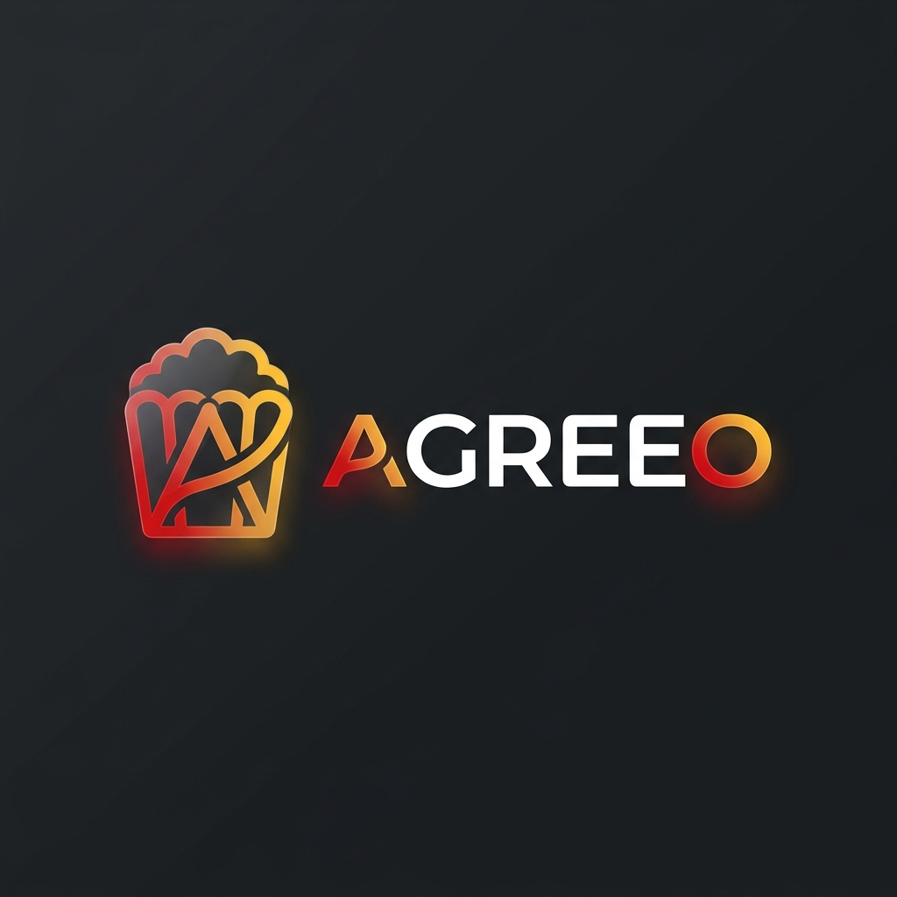

# Linee Guida di Design & Palette di Colori — Agreeo (Cinema Popcorn Edition)

Questo documento definisce l'identità visiva, la palette di colori e i componenti grafici dell'applicazione **Agreeo**. L'esperienza utente è basata sul tema **Cinema Popcorn**, progettato specificamente per ambienti scuri immersivi (Dark Mode), con ricchi accenti rosso cinema e oro caramello.

---

## 🏆 Logo Ufficiale dell'App

Abbiamo generato il logo ufficiale di brand basato sul nuovo tema: un logo lockup ultra-moderno e minimalista che unisce un simbolo astratto (fusione di un secchiello di popcorn e la lettera 'A' stilizzata) alla scritta wordmark 'Agreeo' realizzata con un font futuristico, elegante e audace. Il design utilizza i toni rosso cinema, oro caldo e bianco popcorn su sfondo scuro con finiture in vetro e accenti neon.



---

## 🎨 Palette dei Colori (Color System)

Tutti i componenti visivi dell'applicazione utilizzano i token colore definiti nella classe [AgreeoColors](file:///c:/Users/Anton/agreeo/lib/shared/theme/agreeo_colors.dart#L7-L41):

| Nome Token | Codice HEX | Descrizione e Utilizzo | Effetto Visivo |
| :--- | :--- | :--- | :--- |
| **`cinematicRed`** | `#E50914` | Rosso ispirato alle sale cinematografiche. Usato per azioni principali, pulsanti attivi, badge e primo step di Onboarding. | Cattura l'attenzione immediata. |
| **`popcornWhite`** | `#FFFFFF` | Bianco puro. Usato per i testi principali, icone e contorni dei pulsanti secondari. | Contrasto perfetto e leggibilità massima. |
| **`anthraciteBlack`** | `#1E1E1E` | Sfondo principale dello Scaffold e dei blocchi di base. | Tonalità scura calda, meno aggressiva del nero puro. |
| **`darkSurface`** | `#2A2A2A` | Sfondo di card, contenitori elevati, fogli di opzione e campi di input. | Distingue i blocchi interattivi dallo sfondo. |
| **`kernelGold`** | `#FFFFC107` | Giallo oro caldo. Usato per stelle di rating, preferiti, salvataggi in watchlist e secondo step di Onboarding. | Evoca il colore del popcorn caramellato e delle stelle dei film. |

---

## ✨ Effetti Visivi e Decorazioni

### 1. Warm Glows (Bagliori Caldi)
I componenti attivi o selezionati utilizzano ombre sfumate basate sui due colori accento principali:
* **Generi (Rosso)**:
  ```dart
  BoxShadow(
    color: AgreeoColors.cinematicRed.withOpacity(0.25),
    blurRadius: 8,
    spreadRadius: 1,
  )
  ```
* **Film (Oro)**:
  ```dart
  BoxShadow(
    color: AgreeoColors.kernelGold.withOpacity(0.35),
    blurRadius: 10,
    spreadRadius: 1,
  )
  ```

### 2. Bordi Sottili Cinema
Per delineare i bordi delle card in modo elegante e coerente col tema scuro, si usa un bianco semitrasparente a basso contrasto:
```dart
border: Border.all(
  color: Colors.white.withOpacity(0.1),
  width: 1.0,
)
```

---

## 📐 Onboarding & Coerenza Visiva

### Schermata di Onboarding
* **Flusso a 2 Step**:
  1. *Step 1: Generi Preferiti* — Evidenziato in **Cinematic Red**. I chip dei generi selezionati hanno bordi rossi luminosi e checkmark.
  2. *Step 2: Film Preferiti* — Evidenziato in **Kernel Gold**. I poster selezionati nella griglia acquisiscono un bordo oro, un overlay semitrasparente oro e un badge rotondo dorato con spunta nera.
* **Pulsante di Progresso e Barra**: La barra in alto e il pulsante "Continue" usano un gradiente lineare che sfuma elegantemente da **Rosso Cinema** a **Oro Popcorn**, accendendosi non appena le condizioni del passaggio sono soddisfatte.
